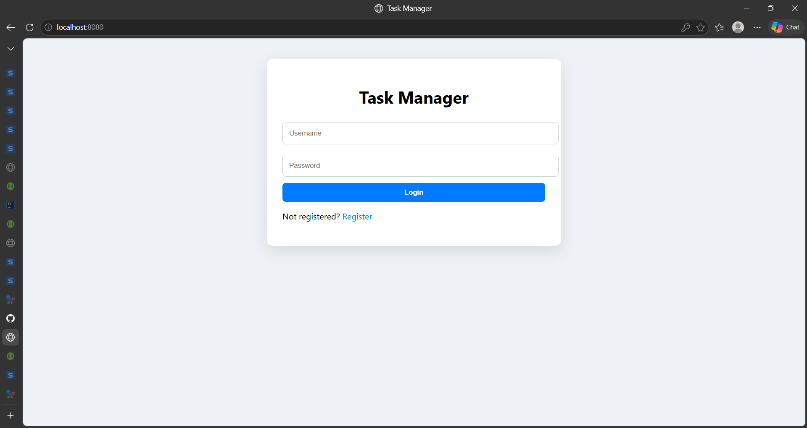
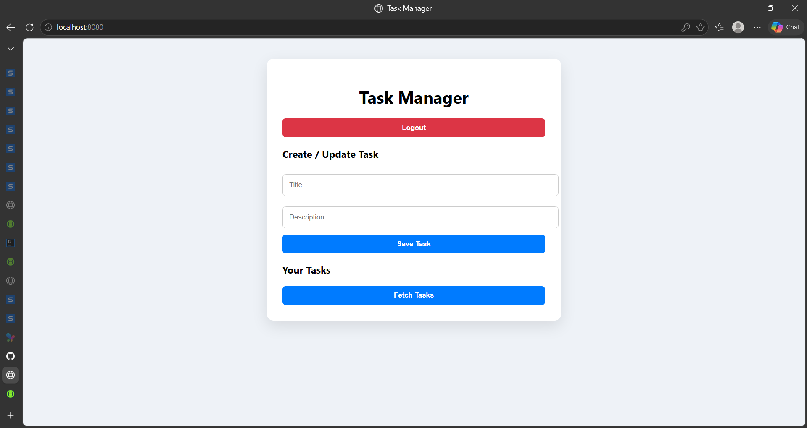
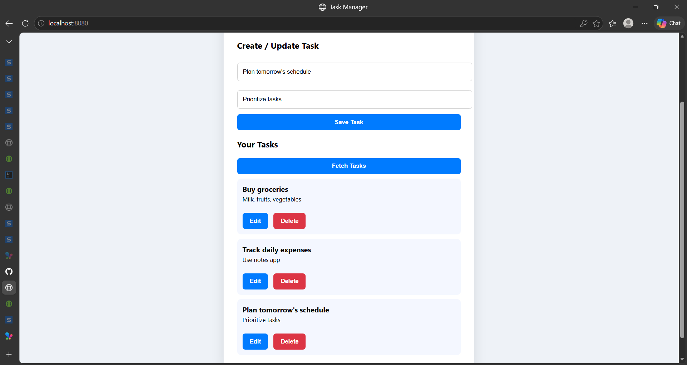

# 📝 Task Manager Application


A full-stack Task Manager application built using **Spring Boot**, featuring **JWT-based authentication**, secure REST APIs, and a responsive frontend interface.

This project demonstrates key backend engineering concepts such as **stateless authentication, role-based authorization, input validation, and scalable API design**, along with seamless frontend-backend integration.

---

## 🚀 Features

### 🔐 Authentication

* User Registration
* User Login
* JWT-based Authentication
* Secure API access using tokens

### 🔒 Authorization

* Role-based access control (USER vs ADMIN)
* ADMIN endpoints are protected and accessible only with appropriate roles

### 📋 Task Management

* Create Task
* Fetch All Tasks
* Update Task
* Delete Task

### ✅ Validation

* Input validation using Jakarta Validation (`@Valid`, `@NotBlank`, `@Email`)
* Structured error handling

### 🎨 Frontend

* Login-first UI
* Dynamic dashboard
* Task cards with Edit/Delete
* Empty state handling
* Clean and responsive design

---

## 🛠️ Tech Stack

* Backend: Spring Boot
* Security: Spring Security + JWT
* Database: PostgreSQL
* Frontend: HTML, CSS, JavaScript
* API Testing: Swagger, Postman

---

## 🗄️ Database

* PostgreSQL is used as the primary database for storing users and tasks.

### Tables

**Users Table**

* id (Primary Key)
* username
* password (hashed)
* role (USER / ADMIN)

**Tasks Table**

* id (Primary Key)
* title
* description
* user_id (Foreign Key)

---

## 📂 Project Structure

```
src/
 ├── controller/
 ├── service/
 ├── repository/
 ├── model/
 ├── security/
 ├── config/
 └── exception/

index.html
pom.xml
README.md
```

---

## ⚙️ Setup Instructions

### 1. Clone the repository

```
git clone https://github.com/kp5406mbi-cloud/task-manager-springboot.git
cd task-manager-springboot
```

### 2. Run the backend

```
mvn spring-boot:run
```

### 3. Access the application

* Backend: http://localhost:8080
* Swagger UI: http://localhost:8080/swagger-ui/index.html

---

## ▶️ Run Frontend

After starting the backend:

* Open `index.html` in your browser
* Login/Register and start using the application

---

## 🔑 API Endpoints

### Auth APIs

| Method | Endpoint              |
| ------ | --------------------- |
| POST   | /api/v1/auth/register |
| POST   | /api/v1/auth/login    |

### Task APIs

| Method | Endpoint           |
| ------ | ------------------ |
| GET    | /api/v1/tasks      |
| GET    | /api/v1/tasks/{id} |
| POST   | /api/v1/tasks      |
| PUT    | /api/v1/tasks/{id} |
| DELETE | /api/v1/tasks/{id} |

---

## 🔒 Security

* JWT-based authentication
* Stateless session management
* Protected endpoints using Spring Security
* Role-based access control
* JWT token must be passed in Authorization header:
  Authorization: Bearer <token>

---

## 🧪 API Testing

* Swagger UI
* Postman

---

## 📸 Screenshots

### 🔐 Login Page



### 📊 Dashboard



### 📋 Tasks



---

## 📈 Scalability Considerations

* Stateless authentication using JWT enables horizontal scaling
* Database can be scaled using replication and indexing
* Microservices architecture can separate auth and task services
* Caching (Redis) can reduce database load
* Load balancers can distribute traffic across instances

---

## 🚀 Deployment

The application can be deployed using platforms like **Render** or **Railway** for backend hosting.

---

## 👨‍💻 Author

**Kumar Piyush**
Mathematics and Computing, BIT Mesra

---


